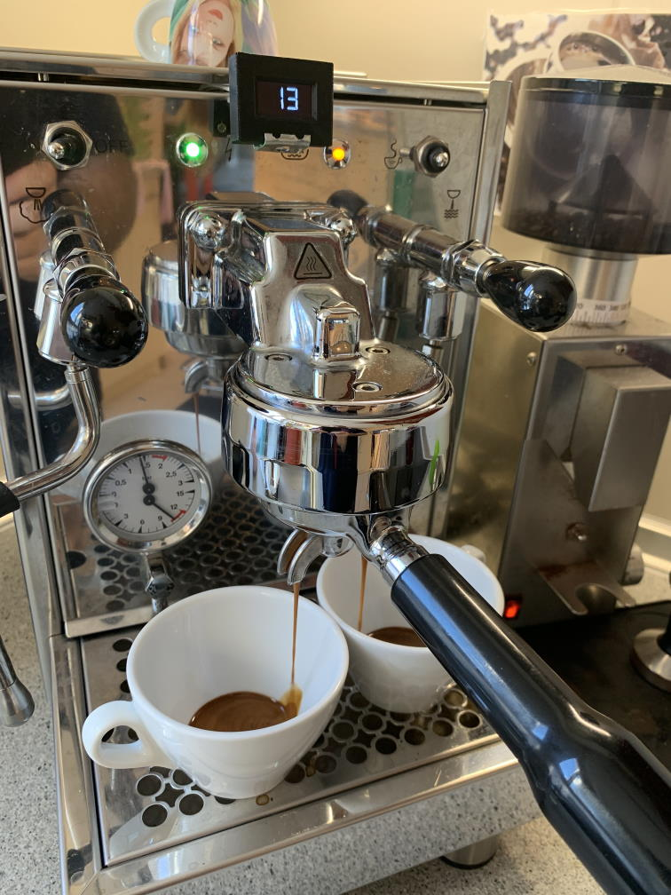
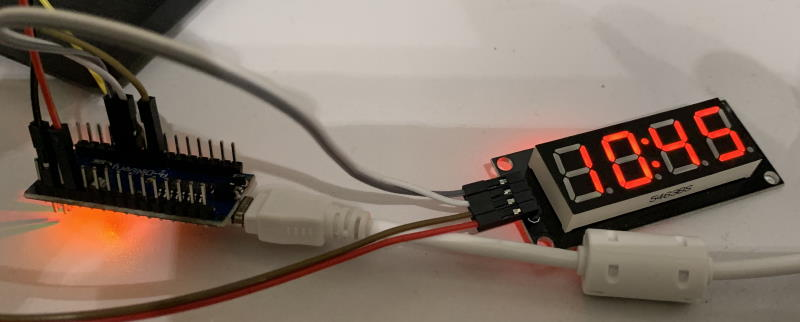
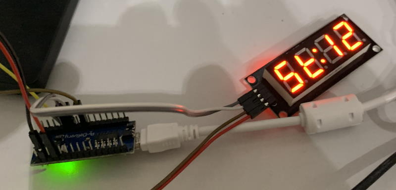

# Espresso Shot Timer

Simple shot timer with 7-Seg style graphic output, temprature display and signaloutput for a relais for baristlights during shot (version 06/06/2016) to use with an OLED diplay via I2C.
Original author is David Kißling (user mactree of http://www.kaffee-netz.de)

# Was ist der Espresso-Shot-Timer?

Der *Espresso-Shot-Timer* ist eine Nachrüst-Erweiterung für Espresso-Siebträgermaschienen, die keinen eingebauten Zähler für die Espresso-Bezugszeit haben. Er zeigt die Sekunden ab Bezug an, ohne umständlich extra Stoppuhren bedienen zu müssen und ermöglicht dadurch einfach ein konsistentes, perfektes Ergebnis :)

## Features

- Anzeige der Bezugszeit (*shot timer*)
- weitere optionale Features
  - Anzeige der Temperatur an einem Meßpunkt (zBsp: Brühgruppe, Kessel)
  - Anzeige der Temperatur eines weiteren Meßpunktes
  - Anzeige der Pre-Infusion-Dauer
  - geplant: Anzeige der Einschaltdauer

## Konfigurationen & Varianten

- Display: OLED oder 7-Segment-LED
- Temparatur-Sensoren für Brühgruppe und/oder Kessel
- Anzeige für PreInfusion

### Basic (7-Segment-LED - ohne Temparatursensor)

- Zeigt an, wie lange das Gerät angeschaltet ist (= Aufheizzeit) - *mäßige Helligkeit*
- Zeigt die Bezugszeit an (Shot-Timer) und hält diese für 10 Sekunden nach - *hohe Helligkeit*
- danach wieder Wechsel zur Einschaltdauer

### 7-Segment-LED mit einem Temparatursensor

- Zeigt die Temparatur des Sensors an
- Zeigt die Bezugszeit an (Shot-Timer) und hält diese für 10 Sekunden nach; danach wieder Wechsel zur Einschaltdauer

### OLED mit einem Temparatursensor

- Zeigt die Temparatur des Sensors an
- Zeigt die Bezugszeit an (Shot-Timer) und hält diese für 10 Sekunden nach; danach wieder Wechsel zur Einschaltdauer

### OLED mit zwei Temparatursensoren

- Zeigt die Temparatur der Sensoren an (Kessel und Brühgruppe)
- Zeigt die Bezugszeit an (Shot-Timer) und hält diese für 10 Sekunden nach; danach wieder Wechsel zur Einschaltdauer

## Kompatibilitätsliste

Der *Espresso-Shot-Timer* wurde erfolgreich mit folgenden Geräten verwendet:

- Bezzera BZ 10
- Bezzera BZ 99
- Bezzera Mitica Top
- La Cimbali Junior
- La Marzocco Linea
- La Marzocco Linea Mini
- La Spaziale S1 Vivaldi II
- SAB Pratika

## Einsatzgebiete

Der Timer mit dem OLED Display ist ausschliesslich für den Betrieb ausserhalb der Maschine gedacht.
Der Timer mit der SiebenSegment LED Anzeige kann auch im innern der Maschine verbaut werden.

## Vorrausetzungen

Wenn du diesen Timer verbauen willst musst du dir die folgenden Sachen zutrauen:
- Maschine öffnen
- Netzschalter erkennen 
- Pumpe erkennen 
- 3Wege Magnetventil (Gruppenventil) erkennen

## Mögliche Einschränkungen

Wenn der Signalabgriff an der Pumpe erfolgt, springt der Timer auch bei der Kesselbefüllung an.
Je nach Kabelführung kann es durch Elektromagnetische Einstreuung zu abstürzen des Timers kommen.

Weitere siehe hier: https://www.kaffee-netz.de/threads/vorstellung-projekt-espresso-shot-timer-mit-temperaturanzeige.85390
